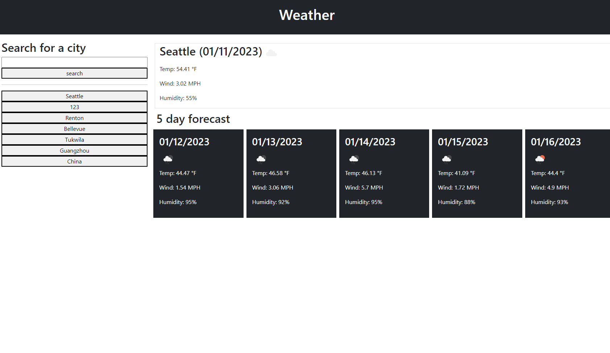

# weather-forecast
a weather application that shows you the forecast of a city

## Description

This website will show you the 5 day weather forecast of a city that the user enter into the search bar. It will show the temperature, an icon reflecting the weather, the humidity, wind speed and date. The searched city will then be saved and displayed as a button underneath the search bar. If user want to quick search that city again they can just click on that button. 

What I learned from this project is the usages of jquery and apis. I also learned to use bootstrap for my html. I used fetched to get json data from a weather api. I took user input in the search bar and used it as a query for the api. I then took json data from the response and displayed it into my html with jquery. I also used local storage to be able to store old searches. 

## Installation

N/A

## Usage

- open to the page
- type a city into the search bar
- look at the 6 day weather of the city you searched displayed on the page. 
- if you want to look up an city that was previously searched click on the button corresponding the city. 

[https://jjackielee.github.io/weather-forecast](https://jjackielee.github.io/weather-forcast)

## Credits

N/A

## License

N/A

---

## Features

When you enter a city in the search bar it will show you the weather of that city that was entered for the next 5 days. Users are also able to do a quick old search by clicking one of the buttons below the search bar. 
